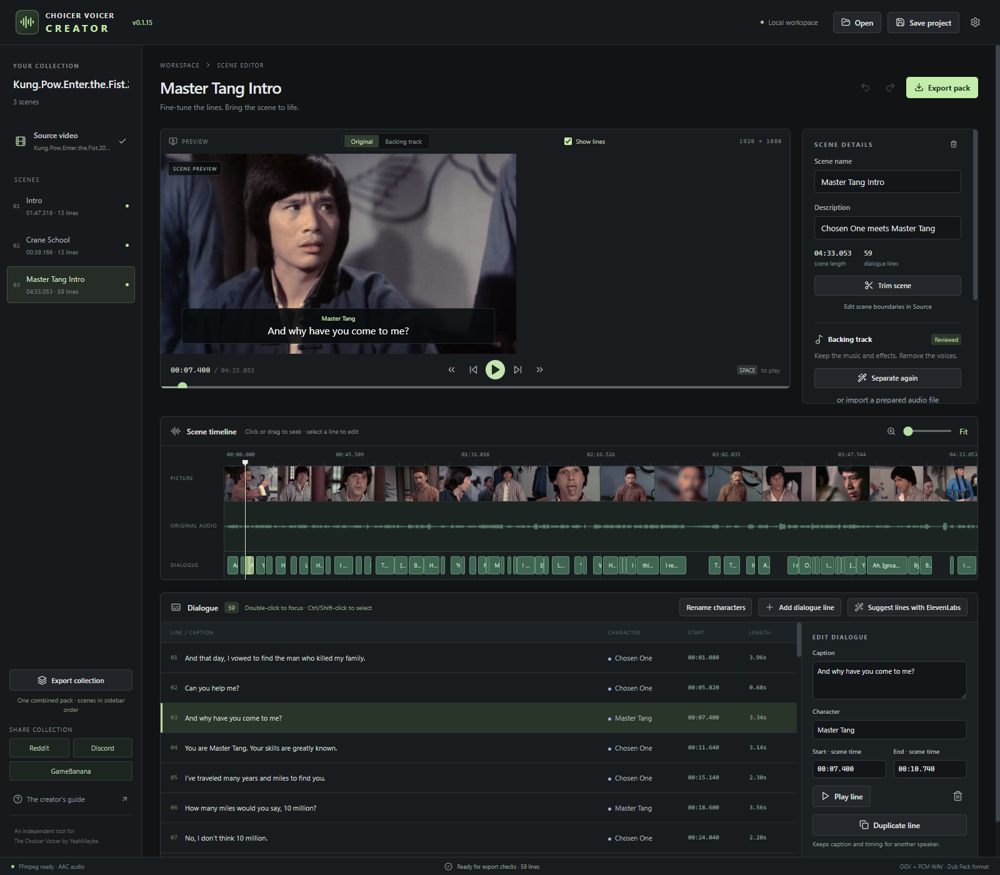
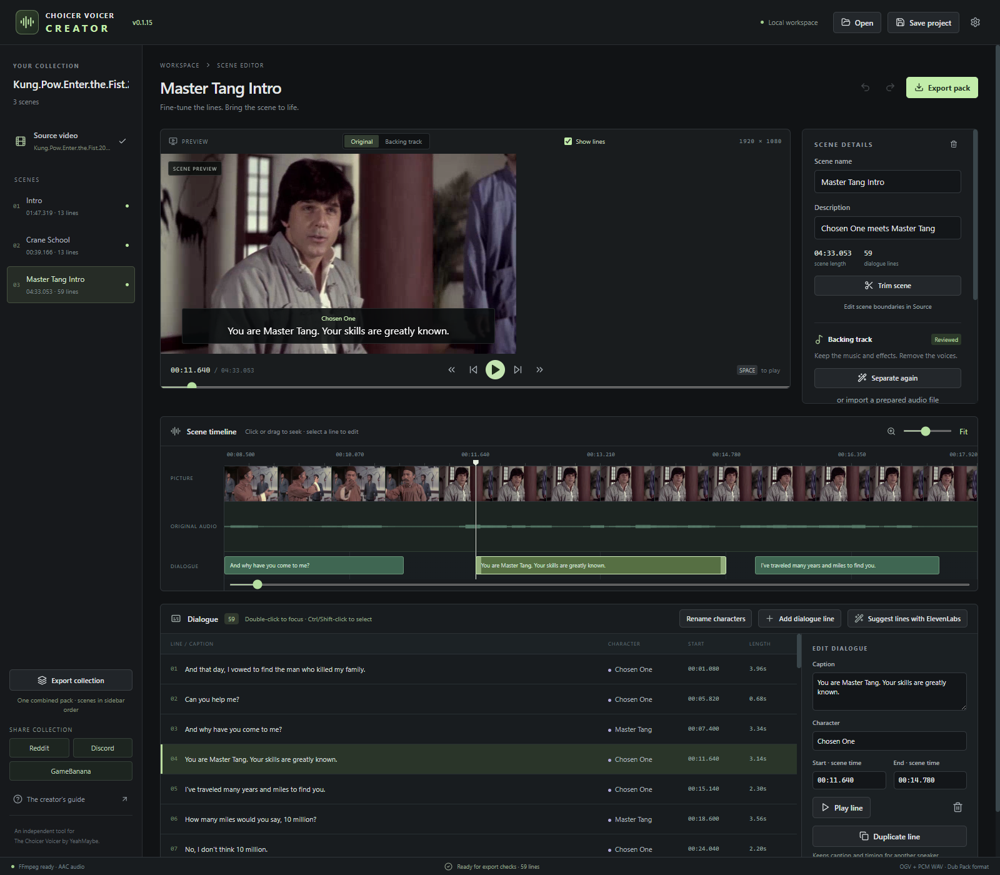
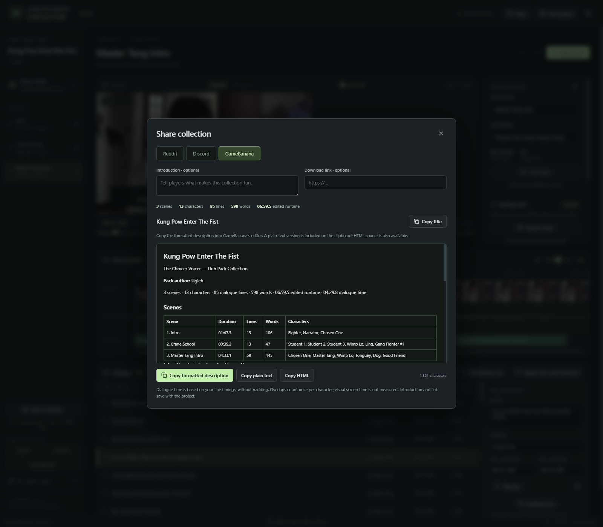

# Choicer Voicer Creator

A Windows desktop editor for turning videos into collections of Choicer Voicer Dub Packs. An independent fan tool; not affiliated with YeahMaybe. No game files are included.

This project was built with **ElevenLabs** in mind for separating dialogue from background audio to create backing tracks, and transcribing dialogue into timed lines with speaker labels. **ElevenLabs is optional:** you can create and time dialogue lines manually, import a backing track made with another tool or use a silent background, and export packs without an ElevenLabs account or API key.



- Import common video formats and edit scenes with a preview, waveform, and timeline pictures.
- Create and time dialogue lines, merge or duplicate them, and rename characters in bulk.
- Optionally use ElevenLabs for captions and background separation, or edit and export without an API key.
- Export one scene or combine a collection into a single Dub Pack.
- Generate Reddit, Discord, and GameBanana descriptions with scene and character statistics.

## Screenshots

Captured from an existing **Kung Pow Enter The Fist** project in v0.1.15: three scenes, 85 dialogue lines, and 13 character labels.

<details>
<summary>Precise dialogue timing</summary>



</details>

<details>
<summary>Collection sharing and statistics</summary>



</details>

The screenshots illustrate the editor using an existing local project. The movie, project file, generated audio, and exported pack are not part of this repository.

## Download and open the app

Get the Windows x64 app from [GitHub Releases](https://github.com/Ugleh/Choicer-Voicer-Creator/releases/latest). **No Node.js, npm, or build tools are needed.**

- **Installer:** download the `windows-x64-setup.exe` file and follow its wizard.
- **ZIP:** download the `windows-x64.zip` file, extract it completely, and run **Choicer Voicer Creator.exe**. Keep all included files together. Settings and caches still use Windows AppData.

Use these release assets, rather than GitHub's **Source code** archives. Builds are unsigned, so Windows may show an unknown-publisher warning. Save your project and close the editor before updating; the app does not automatically update. For ZIP updates, extract into a new folder. Each release includes SHA-256 checksums.

For a local source checkout, double-click **Launch Creator.cmd**, or run `release/v0.1.17/win-unpacked/Choicer Voicer Creator.exe` after packaging. Keep the entire `win-unpacked` folder together. Save and close any older app window before reopening through the launcher to use the latest version. The running version appears in the header and in **Settings & usage**, which also shows the executable path.

Install [FFmpeg and FFprobe for Windows](https://ffmpeg.org/download.html#build-windows), then add them to PATH or set their executable paths in **Settings & usage** (for example, `C:\ffmpeg\bin\ffmpeg.exe` and `C:\ffmpeg\bin\ffprobe.exe`). The build needs `libtheora`, `libvorbis`, `libx264`, and `ffv1` encoders. The FFmpeg/FFprobe command-line tools are not bundled. For a source checkout, follow the development instructions below to run or package the application.

Supported inputs: **MP4, MKV, MOV, AVI, WebM, M4V, WMV, ASF, MPG, MPEG, TS, MTS, M2TS, FLV, OGV, 3GP, 3G2, and VOB**. The picker, drag-and-drop, and missing-source locator accept the same formats. Files must contain both video and audio, and their codecs must be supported by your FFmpeg installation. The existing preview and export pipeline handles them without extra tools or cloud processing.

Version 0.1.1 automatically removes invisible text-direction markers and wrapping quotes from copied executable paths, including existing saved settings.

## Make a collection

1. Drop one video file anywhere in the app, or use **Choose a video**. A local H.264 preview, waveform, and filmstrip are generated. First import converts the full movie and can take several minutes and additional disk space, especially for HEVC sources. The progress panel shows each step, percentage, elapsed time, and processed movie time; conversion speed and estimated remaining time appear when available. Estimates are for the current step and may vary. Cancel is available; finished previews are reused, including those created by older versions. Dropping another video asks before replacing a collection that has scenes; wait for active processing to finish before dropping another file.
2. Choose an audio language track before creating scenes. Enter **Pack title** and **Pack author** on the Source screen. Pack title controls the exported title and folder name independently of the source filename; individual scene packs add the scene name. Leave it blank to use the collection name. Titles are saved in the project.
3. Select a source range by dragging on the timeline or by setting **IN / OUT**. Click the padlock next to **IN** to hold the start while adjusting **OUT**, or lock **OUT** to hold the end. With both locked, seeking leaves the range unchanged. Drag an IN/OUT handle or use the adjacent frame buttons for fine adjustments. Numeric times apply on Enter or when leaving the field; Escape cancels typing. Create a scene; repeat for other scenes in the movie. Source timings are seconds from the movie. Line timings are seconds from the start of a scene. Locks apply to the current selection and reset when opening a collection, switching editing contexts, or creating a scene/line; they are not saved in the project.
4. Inside a scene, click **Add dialogue line**, mark its **START / END**, then **Create dialogue line**. Times are relative to the scene in **MM:SS.mmm**, matching the preview clock and timeline ruler. Fields also accept seconds: `01:34.699` and `94.699` mean the same time. **Cancel new line** returns to browsing. Edit an existing line's caption, character, and timing in Edit Dialogue, or select it and drag its clip edges. Selected clips appear above overlapping clips; only selected clips expose resize handles. Zoom and scroll the waveform to inspect detail. Alternatively, use ElevenLabs to suggest timed lines, review them, and apply. **Ctrl-click** dialogue rows to select/toggle several lines. Edit Dialogue then lets you **Apply character** to the selection or **Merge lines**. Merging joins captions in chronological order, keeps the earliest start and latest end, and preserves pauses. Assign one common character first if the selection has different characters. Both operations support Undo/Redo. Merges over six seconds are allowed with a recommendation; 60 seconds or longer is blocked.
5. A backing track is optional. Generate one with ElevenLabs or import audio already trimmed to the scene from any other tool. Switch the preview to **Backing track** and listen. Check the review box only after inspecting voice leakage, music, and effects. If none is provided, export creates a silent backing WAV and takes dialogue from the original movie; those clips can contain music/effects, but there is no continuous background bed. This workflow needs no API key. **Use silent background instead** removes the current backing choice, with Undo available. A missing previously saved backing file is reported and needs reimport or an explicit choice of silence. Shortening a scene with **Trim scene** also trims available backing/vocal audio; extending it requires replacement audio if you want a backing track.
6. **Save project** to a `.cvcreator` file. **Export pack** creates a pack for the selected scene. **Export collection** joins all scenes, in sidebar order, into one pack with one OGV video and one backing WAV. Dialogue filenames are numbered across the collection and their metadata timestamps are shifted to the combined video's clock. Select the game's `packs_voice` folder, or another folder for reviewing the results first.

Existing exported folders are never overwritten. Metadata and line duration checks run before publishing a staged pack folder. Cancellation or failure removes the unfinished export. Combining scenes uses temporary lossless video segments, which require additional disk space. Each scene ends on a whole video frame; its last image is held and audio padded with silence for less than one frame when necessary. This keeps video, backing, and subsequent dialogue aligned without changing playback speed.

Version 0.1.9 fixes shortened dialogue exports caused by timestamp jumps during loudness normalization. Audio timing is rebuilt after normalization and the final WAV is bounded by sample count. Verification remains enabled; a failure now identifies the scene, caption, expected duration/format, and actual result.

**Double-click a dialogue line** in the list or timeline to pause at its start and center/zoom the scene timeline around it with surrounding context. Pressing Enter on a dialogue row does the same. **Fit** restores the full scene. Single-click selection and Ctrl-click multi-selection keep their existing behavior. Timeline clips show captions without a number prefix; the separate dialogue list keeps its numbering.

Timeline pictures are sampled from the currently visible source/scene range and refresh when zooming or scrolling. Zoom in for closer picture spacing; hover over a picture for its time. Frames are generated locally from the existing preview and cached, without reconverting the movie. Background requests are debounced, superseded work is cancelled, and picture loading leaves editing available. A failed picture request offers Retry in the picture strip.

Dialogue audio includes **0.5 seconds of padding on each side** by default, including when opening older projects. Adjust **Line padding · seconds per side** in Scene Details (0–5 seconds; 0 disables it). Play line and exported WAVs use the wider cut from the isolated vocal stem when available, otherwise the original movie audio. Padding stops at scene edges. Exported timestamps move earlier by the actual leading padding so speech stays synchronized. The original movie, scene boundaries, backing audio, and saved line start/end values do not change. Padding counts toward the game's under-60-second clip limit; the six-second suggestion remains based on the spoken line. Added context may contain neighboring speech, so audition it when lines are close together. **Play line** and **Play selected range** bring the preview into view and focus it.

**Shift-click** selects every dialogue row between the last clicked anchor and the new row in displayed time order. Further Shift-clicks keep that anchor; **Ctrl+Shift-click** adds the range to the existing selection. The same modifiers work on timeline clips. **Rename characters** above the dialogue list changes every matching label at once, such as Speaker 1 → Nut Vendor. It defaults to the current scene; choose **Entire collection** deliberately when those labels refer to the same people in other scenes. Renames support Undo/Redo and save with the project.

**Show lines** in the preview displays every caption active at the playhead, with its character, during normal playback or backing-track audition. It is on by default and remembers your preference. Overlapping captions appear together without selecting a dialogue row. **Start of scene** and **End of scene** jump to the first/last preview frame; frame stepping and the preview scrubber stay within the scene. The preview clock is relative to the scene. Reopening a collection starts at its first scene.

Scenes are edited independently, with no nested scenes, and can be exported individually or combined. Click **Trim scene** in Scene Details to shorten the scene's start/end. Its temporary START/END controls use the current scene's clock, with locks, frame buttons, waveform handles, and audition. The summary shows how many dialogue lines will be shortened or removed outside the retained range. **Apply trim** shifts surviving lines to the new scene start and creates trimmed copies of the backing and isolated vocal WAVs; captions remain editable for review. **Undo** restores the original scene, lines, and audio. Original files are retained. No ElevenLabs request is needed. **Cancel trim** leaves the scene unchanged. **Edit scene boundaries in Source** remains available for source-level adjustments.

Overlapping lines, including identical start times for different characters, can be created and exported. Overlap produces a review warning, not an export error. The editor auditions the source audio; it does not simulate the game's recorded-voice mix. Exact simultaneous playback in the game has not been verified. Current stem separation keeps all voices together in a vocal stem: duplicating a group shout into four character clips does not isolate the four speakers.

For several characters saying the same words together, select a line and click **Duplicate line** in Edit Dialogue. It copies the exact start/end, caption, and character, then selects the copy and focuses **Character** so you can enter another speaker. Repeat for each speaker. Ctrl-click several lines and choose **Duplicate selected lines** to copy them together. Copies have independent identities and edits; Undo/Redo treats each duplication as one operation. Each copy exports its own numbered WAV and INI with the same timestamp.

## Sharing a collection

The **Reddit**, **Discord**, and **GameBanana** buttons beneath Export collection open a sharing panel. Each format includes the pack title, author, scenes, cast, and totals for lines, caption words, edited runtime, and dialogue time. Add an optional introduction and download link; they save with the project. Copy the title separately from the body. Sharing uses the current edits and does not require a successful media export, an API key, or a social account connection.

- **Reddit:** Markdown with scene and character tables, for the desktop Markdown editor.
- **Discord:** compact lists split into messages below the standard 2,000-character limit. Choose and copy each numbered message. Generated text neutralizes accidental mentions in names or descriptions.
- **GameBanana:** formatted HTML with a plain-text clipboard fallback, plus separate Copy plain text and Copy HTML options. Review the pasted formatting in the destination editor before submitting.

Words are counted from captions once per dialogue line, including independently duplicated lines. Dialogue time uses original line boundaries, excludes padding, and merges overlapping intervals for the same character in each scene. The collection dialogue total merges overlaps across all characters, so individual character totals can add up to more than the collection total. This is dialogue coverage, not visual screen time or a speech-detector measurement; silence inside a marked line counts. Edited runtime sums scene lengths without gaps in the source movie or the small frame-alignment padding used during export. Invalid timing is excluded from dialogue-time totals and noted in the generated text. Local source/stem paths and API settings are not included.

## Keys, cloud processing, and costs

Add your ElevenLabs API key in Settings. Windows encrypts it using Electron safeStorage; it is never stored in the renderer or in project files. Only selected scene audio is uploaded when **Upload scene & run** is clicked. AI jobs are limited to ten-minute scenes. Manual editing/export works without a key.

- Captions use `scribe_v2`, word timing, and speaker diarization. Character names still need human review.
- Separation uses `two_stems_v1`. Named instrumental and vocal stems are decoded to WAV. The instrumental is the backing track; available isolated vocals supply exported dialogue clips. MP3 128 kbps is requested for broad account compatibility, so saving the result as PCM WAV does not make the separation lossless.
- This is music-oriented separation. Preservation of film effects is not guaranteed. A prepared WAV from another separation tool can be imported instead.
- Choose your subscription tier under **Cost estimates**. The monthly API presets (checked 2026-09-26) use Scribe v2 for uploaded audio, not Scribe v2 Realtime. Creator is the default when no manual rates were saved; existing manual rates are preserved as custom. The public Creator reference is $0.22/hour and 100 included Scribe v2 hours. Two-stem separation uses a clearly labeled provisional $0.075/min estimate, derived from the published 0.5x Music generation multiplier. Enterprise/Other require custom rates. Enable **Use custom rates** for account-specific or annual pricing; transcription is entered per hour, separation per minute, and the included-hour reference is editable. Blank means unknown; zero is supported.
- Estimates represent the audio usage value before allowances and taxes, not an additional invoice charge. Included hours are reference values, not an account balance; usage in other apps is not tracked or subtracted. Buttons open the official public pricing, stem-pricing explanation, and your subscription page. Presets are dated and do not refresh automatically.
- The transaction log stores operation, duration, status, estimate, request ID, and any returned usage header. New jobs also retain the selected plan, rate, and estimate basis, so later settings changes do not reprice old requests. **Actual invoice amounts are not provided by these endpoints and are not invented.** Hover over a transaction for details.
- Cancellation/network loss may leave a charge at ElevenLabs. Such requests remain unconfirmed. The app never automatically retries them.

## Keyboard

| Shortcut | Action |
| --- | --- |
| Space | Play / pause |
| I / O | Mark scene IN / OUT on Source, or START / END while adding a line or trimming a scene |
| Left / Right | Step by one nominal source frame |
| Shift + Left / Right | Move one second |
| Ctrl + S | Save collection |
| Ctrl + Z / Ctrl + Shift + Z | Undo / redo |

Frame steps on variable-frame-rate media are approximate. Numeric boundaries are stored to milliseconds and used for audio extraction. Video cuts remain limited to real encoded frame boundaries.

## Export shape

With **Pack title** set to `Kung Pow`, **Export collection** creates:

```text
packs_voice/
  Kung Pow/
    dub_video.ogv
    _backing_track.wav
    _pack_info.ini
    _author.txt
    _scene_index.txt
    01_ThatsALotOfNuts.wav
    01_ThatsALotOfNuts.ini
    ...
```

`_scene_index.txt` lists scene start times for reference. Using **Export pack** on individual scenes instead creates:

```text
packs_voice/
  Kung Pow - Thats A Lot Of Nuts/
    dub_video.ogv
    _backing_track.wav
    _pack_info.ini
    _author.txt
    01_ThatsALotOfNuts.wav
    01_ThatsALotOfNuts.ini
  Kung Pow - Cow Fight/
    ...
```

Video is Theora at up to 1280 pixels wide with the original scene audio retained for reference preview. The backing track is stereo 48 kHz PCM 16-bit WAV; dialogue is mono 48 kHz PCM 16-bit WAV, optionally loudness-normalized. Pack metadata uses Godot-style `[data]` INI, `dub_timestamps=[3.420]`, and `dub_characters=["Nut Vendor"]`. No per-word timestamps are exported. See [research and compatibility notes](docs/RESEARCH.md).

## Storage and recovery

The application stores settings, recovery, transaction history, previews, and generated stems in its Electron user-data directory (`%APPDATA%\choicer-voicer-creator` in development; the packaged app may use its product name). Project files reference original source media and these cached stems; they are not portable media bundles. Keep both available. Reopening regenerates a missing video preview; a missing source can be relinked. Missing backing audio needs reimport/separation. The latest collection is automatically snapshotted; **Recover your last editing session** appears on the welcome screen.

## Development

Use Node **22.12+** (24 recommended) and npm. FFmpeg and FFprobe must also be on PATH to run the media and desktop checks.

```powershell
npm ci
npm run dev
npm test
npm run test:integration
npm run build
npm run test:desktop
npm run test:drop
npm run test:selection
npm run test:dialogue
npm run test:duplicate
npm run test:preview
npm run test:timing
npm run test:trim-audio
npm run test:dialogue-audio
npm run test:collection
npm run test:collection-ui
npm run test:timeline
npm run test:timeline-ui
npm run test:line-padding
npm run test:dialogue-qol
npm run test:sharing
npm run test:sharing-ui
npm run test:pricing
npm run test:pricing-ui
npm run package
```

The desktop smoke test uses Playwright's Electron support, generated media, and intercepted native file dialogs. Tests do not submit paid API jobs. The integration test creates `.test-data` fixtures. The packaged app is unsigned, and FFmpeg remains an external dependency.

To refresh the documentation screenshots using a saved project with an existing preview cache:

```powershell
npm run build
node scripts/capture-project-screenshots.cjs "path\to\your-project.cvcreator"
```

This opens a separate editor session, reuses the cached preview, and writes three images to `docs/screenshots/`. It checks that the source project is unchanged and does not load personal API settings. Set `CV_PACKAGED_EXE` to capture a packaged build, or `CV_FFMPEG_PATH` / `CV_FFPROBE_PATH` if the tools are not on PATH.

The repository excludes local projects, movies, audio, exported packs, credentials, dependencies, and build output. Screenshots in `docs/screenshots/` are tracked.

## Publishing downloadable builds

`npm run package:release` creates an installer, ZIP, checksums, and release notes under `release/vVERSION/`. `npm run test:release` checks those downloads and launches the extracted ZIP in an isolated profile. Pushing a matching `vVERSION` tag runs the **Windows release** GitHub Actions workflow and publishes the tested downloads. Manual workflow runs on a branch produce build artifacts without publishing. See [release instructions](docs/RELEASING.md).

## Current limits

- API adapters are covered by simulated provider responses; actual separation quality and paid requests must be checked with your key and a real scene.
- No installed copy of the game was available for an in-game test. Export compatibility is based on official guidance and a documented real-pack schema.
- One source movie per collection. Combined exports follow sidebar order; there is no scene reordering UI, character artwork editor, or local AI model installer yet.
- Preview caches are retained for reopening; automatic cache eviction is not implemented.
